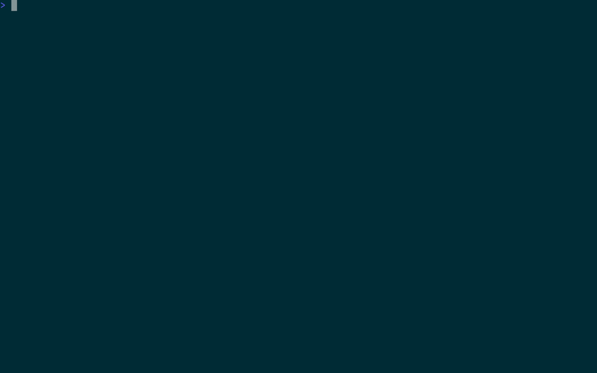

# docker-dash

A terminal UI for managing Docker containers, images, and volumes — without leaving your terminal.



## Why

Switching between the terminal and a Docker GUI breaks flow. `docker-dash` gives you a keyboard-driven interface to inspect and manage your Docker environment, keeping you in the terminal where you already work.

## Features

- Browse and manage containers, images, and volumes
- View container logs and details interactively
- Start, stop, restart, and remove containers
- Exec into running containers
- Filter and inspect image layers

## Install

```bash
go install github.com/GustavoCaso/docker-dash/cmd/docker-dash@latest
```

Or build from source:

```bash
make build
```

## Usage

```bash
docker-dash
```

### Configuration File

By default, docker-dash looks for a config file at `~/.config/docker-dash/config.toml`.

```toml
[docker]
# Docker daemon URL. Accepts tcp, unix, and ssh schemes.
# Defaults to the DOCKER_HOST environment variable.
host = "ssh://pi5@pi5"

[refresh]
# Auto-refresh interval
# Examples: "500ms", "5s", "1m", "2m30s"
interval = "10s"
```

### CLI Flags

| Flag | Description |
|---|---|
| `-config` | Path to config file (default: `~/.config/docker-dash/config.toml`) |
| `-docker.host` | Docker daemon URL (overrides config file) |
| `-refresh.interval` | Auto-refresh interval (overrides config file) |

CLI flags take precedence over values in the config file.

### Keybindings

**Navigation**

| Key        | Action             |
|------------|--------------------|
| `← / →`    | Switch section     |
| `↑ / ↓`    | Move up/down       |
| `j / k`    | Scroll down/up     |
| `/`        | Filter             |
| `?`        | Toggle help        |
| `q`        | Quit               |

**Containers**

| Key        | Action             |
|------------|--------------------|
| `d`        | Container info     |
| `D`        | Delete container   |
| `l`        | View logs          |
| `s`        | Start/stop         |
| `S`        | Stats              |
| `ctrl+R`   | Restart            |
| `e`        | Exec into container|
| `t`        | Show files         |

**Images**

| Key        | Action                  |
|------------|-------------------------|
| `d`        | Delete image            |
| `l`        | Show layers             |
| `c`        | Create and run container|

**Volumes**

| Key        | Action       |
|------------|--------------|
| `d`        | Delete volume|
| `t`        | Show files   |

**Global**

| Key        | Action       |
|------------|--------------|
| `r`        | Refresh      |
| `ctrl+r`   | Refresh all  |

## Development

```bash
make test       # Run tests
make lint       # Run linter
make build      # Build binary
```

Tests use a mock Docker client, so no Docker daemon is required.

## Requirements

- Go 1.21+
- Docker (optional — falls back to mock data without it)
